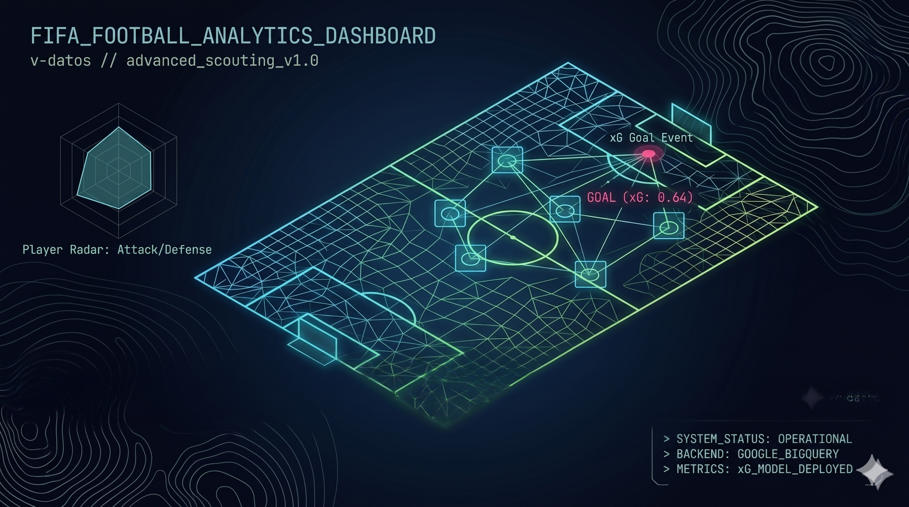

  

<h1 align="center">FIFA Football Analytics Dashboard</h1>

An interactive football analytics dashboard for exploring StatsBomb event data across competitions, matches, teams, and players.

The dashboard is designed for scouting, match review, performance analysis, and football storytelling. It turns event-level match data into visual summaries that help answer practical questions: who created the best chances, which teams handled pressure well, where shots came from, how teams attacked, and how individual players contributed across matches.

**Live dashboard:** [accionar.xyz/dashboards/competitions/](https://accionar.xyz/dashboards/competitions/)

## What You Can Do

- Compare competitions by goals, shots, xG, fouls, cards, tackles, and player/team participation.
- Identify top scorers and compare their goals, shots, and expected goals.
- Review individual matches through team-level scorelines, possession, passing, shooting, xG, and shot maps.
- Profile teams using KPIs, radar charts, shot locations, xG distributions, and attacking pass patterns.
- Search individual players and inspect goals, assists, shots, passing, defensive actions, cards, xG, shot maps, and match-by-match history.
- Filter team and player analysis by competition to separate tournament-specific performance from all-competition totals.

## Dashboard Sections

### Competition Analysis

Use this section to understand a tournament or competition at a high level.

You can select a competition and review:

- Total matches, teams, players, goals, shots, xG, fouls, tackles, cards, and penalty goals.
- Top scorer tables with goals, shots, and total xG.
- Pressure-event comparisons across teams.
- Passing accuracy versus passing accuracy under pressure.

This section is useful for quickly identifying the shape of a competition: attacking volume, discipline, physical intensity, and which teams or players stand out.

### Match Analysis

Use this section for game-level review.

After selecting a competition and match, the dashboard shows:

- Team-versus-team summary.
- Possession share.
- Goals, shots, shots on target, pass accuracy, and total passes.
- xG distribution comparison between both teams.
- Side-by-side shot maps for each team.

This section helps evaluate whether the scoreline matched the chance quality, which team created better opportunities, and where each side generated shots.

### Team Analysis

Use this section to build a team profile.

You can select a team and optionally filter by competition. The dashboard includes:

- Matches played, goals scored, goals conceded, shots, shots on target rate, total xG, xG per shot, pass completion, passes per match, shot assists, defensive volume, and pressure indicators.
- Interactive xG distribution by shot.
- Team performance radar using shooting, chance creation, pressure, set-piece, passing, and goalkeeper distribution metrics.
- Shot map for the selected team.
- Attacking-pass visualization covering crosses, cutbacks, switches, and through balls.

This section is useful for comparing playing styles, attacking efficiency, shot quality, and how a team progresses the ball into dangerous areas.

### Player Analysis

Use this section for individual player review.

You can search for a player, filter by competition, and inspect:

- Position, goals, shots, shots on target, assists, passes, pass completion, cards, tackles, interceptions, fouls, and total xG.
- Player shot map.
- Match-by-match history with goals, shots, assists, and pass accuracy.

This section is useful for scouting, player comparison, and understanding whether production is supported by underlying chance quality.

## Key Metrics

- **Expected goals (xG):** Estimated probability that a shot becomes a goal, based on shot context.
- **Total xG:** Sum of all shot probabilities. Higher values usually mean better or more frequent chances.
- **xG per shot:** Average shot quality. Useful for separating high-volume shooting from high-quality chance creation.
- **Shots on target percentage:** Share of shots that force a save or become goals.
- **Pass completion:** Share of completed passes.
- **Passing under pressure:** Passing performance when the player or team is pressured by opponents.
- **Shot assists:** Passes that directly create shots.
- **Progressive and attacking passes:** Actions such as through balls, switches, crosses, and cutbacks that help advance or finish attacks.
- **Radar normalization:** Team radar values are scaled against the available dataset so strengths and weaknesses can be compared more easily.

## Typical Analysis Workflows

1. Start with **Competition Analysis** to find standout teams, players, and broad tournament trends.
2. Move to **Match Analysis** to inspect a specific game and compare chance quality with the final result.
3. Use **Team Analysis** to understand a team's attacking profile, pressure response, and shot creation patterns.
4. Use **Player Analysis** to investigate individual contribution and match-by-match consistency.

## Data

The dashboard uses StatsBomb-style event data, including shots, passes, pressure events, fouls, cards, duels, team names, player names, match identifiers, and competition labels.

Some metrics depend on event availability. If a competition or player has limited event coverage, certain charts or tables may contain fewer records.

## Notes

This repository contains the dashboard source code and supporting documentation. The public-facing experience is the live dashboard linked above; deployment and infrastructure notes are intentionally kept out of this README.
